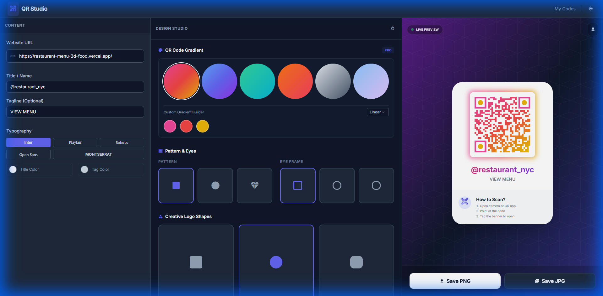
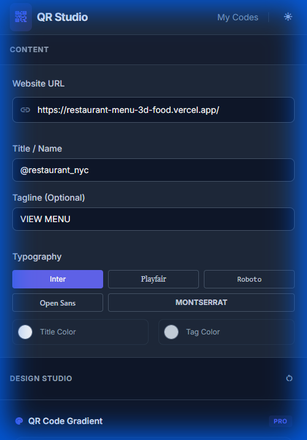

# QR Studio - Professional QR Code Generator

> Create beautiful, customized QR codes with gradient backgrounds, custom logos, and professional styling

## 📸 Preview

<div align="center">
  
### Desktop View


### Mobile View


*Fully responsive design - works beautifully on all devices*

</div>

## ✨ Features

### 🎨 **Advanced Design Studio**
- **Gradient QR Codes** - Choose from 6 beautiful preset gradients or create your own custom gradient
  - Instagram (Pink → Red → Yellow)
  - Ocean (Blue → Indigo → Purple)
  - Emerald (Green → Cyan)
  - Sunset (Orange → Rose)
  - Silver (Gray shades)
  - Lavender (Soft blues and purples)
- **Custom Gradient Builder** - Linear or radial gradients with 3-color stops
- **Pattern Styles** - Square, Dots, or Rounded patterns
- **Eye Frame Styles** - Customize the corner detection markers

### 🖼️ **Logo Integration**
- Upload your own logo (PNG, JPG, SVG)
- **Creative Logo Shapes**
  - Square - Professional and modern
  - Circle - Soft and friendly
  - Rounded - Perfect balance
- Live logo preview with file name display
- Easy logo replacement and removal

### 📝 **Typography & Branding**
- Add custom title and tagline to your QR code
- Choose from 5 professional fonts:
  - Inter (Modern sans-serif)
  - Playfair Display (Elegant serif)
  - Roboto Mono (Technical monospace)
  - Open Sans (Clean and readable)
  - Montserrat (Bold and impactful)
- Custom title and tagline color pickers

### 💫 **Premium UI/UX**
- **Live Preview** - See changes in real-time
- Stunning dark mode interface with glassmorphism effects
- Responsive design - works perfectly on desktop, tablet, and mobile
- Animated gradient glow effects
- Professional preview card with "How to Scan" instructions

### 💾 **Export Options**
- Download as PNG (transparent background)
- Download as JPG (optimized for printing)
- High-resolution output (250x250px QR code)

## 🚀 Getting Started

### Option 1: Open Locally
1. Clone this repository
```bash
git clone https://github.com/TufelMalik/Link-To-QR-Code.git
cd Link-To-QR-Code
```

2. Open `QR/index.html` in your favorite browser
   - No build process required
   - No dependencies to install
   - Just open and use!

### Option 2: Run with Live Server
```bash
# Using Python
python -m http.server 8000

# Using Node.js (http-server)
npx http-server

# Then open http://localhost:8000/QR/
```

## 📖 How to Use

1. **Enter Your URL** - Paste the link you want to encode in the QR code
2. **Customize Design**
   - Choose a gradient preset or create your own
   - Select pattern and eye frame styles
   - Upload a logo (optional)
3. **Add Branding**
   - Add a title (e.g., your business name or social handle)
   - Add a tagline (optional call-to-action)
   - Choose your typography and colors
4. **Download** - Save your QR code as PNG or JPG

## 🎯 Use Cases

- **Restaurant Menus** - Link to digital menus with your branding
- **Business Cards** - Professional QR codes with your logo
- **Social Media** - Beautiful QR codes for Instagram, LinkedIn, etc.
- **Events** - Registration and ticketing QR codes
- **Product Packaging** - Branded QR codes for product information
- **Marketing Campaigns** - Eye-catching promotional QR codes

## 🛠️ Technology Stack

- **Pure HTML/CSS/JavaScript** - No frameworks, blazing fast
- **Tailwind CSS** - Utility-first styling via CDN
- **QR Code Styling Library** - Advanced QR code generation with gradient support
- **Google Fonts** - Inter typography and Material Icons
- **Canvas API** - Logo shape masking and manipulation

## 🎨 Design Philosophy

- **Premium First** - State-of-the-art design that wows users
- **Vibrant Colors** - Carefully curated gradient palettes
- **Smooth Animations** - Micro-interactions for enhanced UX
- **Dark Mode** - Easy on the eyes, professional aesthetic
- **Glassmorphism** - Modern backdrop blur effects
- **Responsive** - Beautiful on all screen sizes

## 📱 Browser Support

- ✅ Chrome (recommended)
- ✅ Firefox
- ✅ Safari
- ✅ Edge
- ✅ Opera

## 🤝 Contributing

Contributions are welcome! Feel free to:
- Report bugs
- Suggest new features
- Submit pull requests

## 📄 License

This project is open source and available under the [MIT License](LICENSE).

## 👨‍💻 Author

**TufelMalik**
- GitHub: [@TufelMalik](https://github.com/TufelMalik)

---

<div align="center">
  
**Made with ❤️ using vanilla JavaScript**

[⭐ Star this repo](https://github.com/TufelMalik/Link-To-QR-Code) if you found it helpful!

</div>